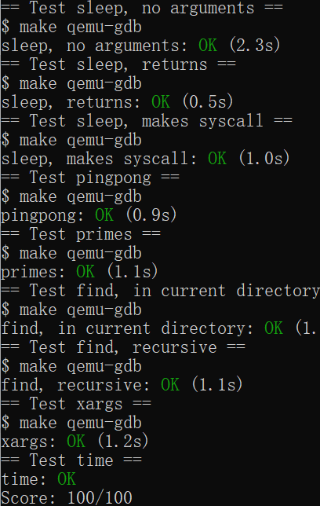
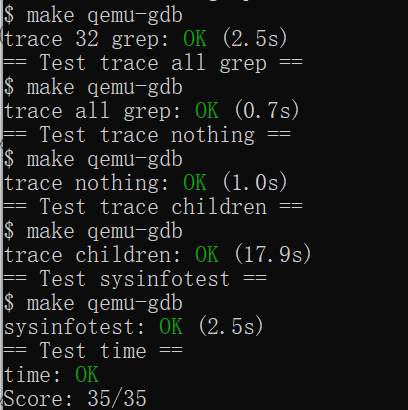
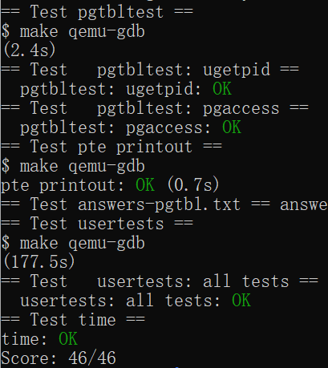
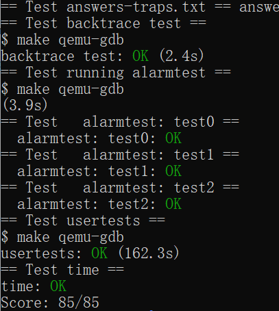
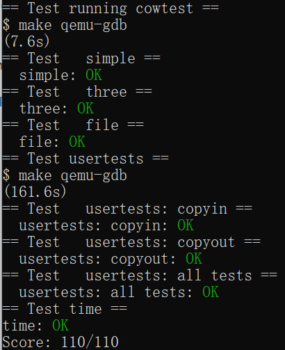
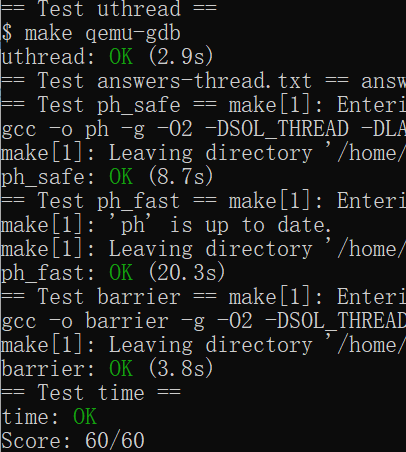
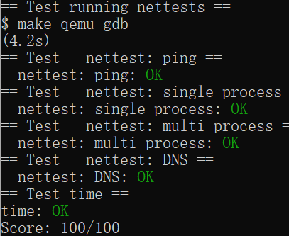
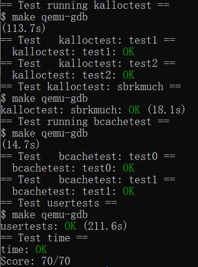
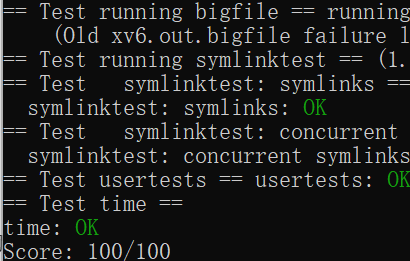
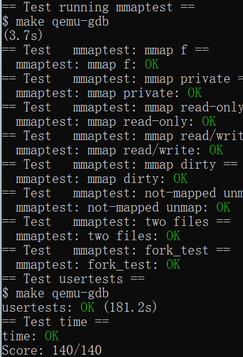

# OS course design

[TOC]

## Lab: Xv6 and Unix utilities

本实验的主要目的是熟悉xv6以及其系统调用。


### 1. Boot xv6 (easy）

#### 1) 实验目的

获取实验室的xv6源代码并切换到`util`分支，构建并运行xv6。

#### 2) 实验步骤

1. 将`xv6-labs-2021`克隆至本地，创建并切换至`util`分支：

   ```bash
   $ git clone git://g.csail.mit.edu/xv6-labs-2021
   Cloning into 'xv6-labs-2021'...
   ...
   $ cd xv6-labs-2021
   $ git checkout util
   ```

2. 构建并运行xv6：

   ```bash
   $ make qemu
   ```

#### 3) 实验中遇到的问题和解决方法

无。

#### 4) 实验心得

1. 学会了如何切换分支。
2. 学会了使用`qemu`运行xv6环境。


### 2. sleep (easy）

#### 1) 实验目的

实现xv6的UNIX程序`sleep`：暂停用户指定的计时数。

#### 2) 实验步骤

1. 在user目录下创建`sleep.c`。

2. 在`sleep.c`中编写程序实现功能：

   - 获取用户提供的参数作为暂停的时钟周期数。
   - 使用`sleep()`系统调用暂停相应的周期数。

3. 在Makefile文件的UPROGS中添加$U/_sleep\。

4. 运行xv6并测试sleep命令：

   ```bash
   $ make qemu
   ...
   init: starting sh
   $ sleep 10
   (nothing happens for a little while)
   $
   ```

5. 测试程序得分：

   ```bash
   $ ./grade-lab-util sleep
   ```

   或是

   ```bash
   $ make GRADEFLAGS=sleep grade
   ```

#### 3) 实验中遇到的问题与解决方法

**问题1**：

不了解如何获取用户输入的参数。

**解决方法**：

通过查询互联网资料了解了`main`函数的两个参数`argc`、`argv`的含义。

> argc：表示运行程序的时候给`main`函数传递了几个参数。
>
> argv：用来存储`argc`个字符串，每个字符串就是给`main`函数传的一个参数。

#### 4) 实验心得

1. 学会了如何处理命令行参数。
2. 学会了`sleep`系统调用的使用方法。


### 3. pingpong (easy)

#### 1) 实验目的

实现xv6的UNIX程序`pingpong`：在两个进程间通过一对管道来传递数据。

#### 2) 实验步骤

1. 在user目录下创建`pingpong.c`。

2. 在`pingpong.c`中编写程序实现功能：

   - 使用`pipe()`系统调用创建一对管道`p2c`和`c2p`用来在两个进程间传递数据。
   - 使用`fork()`系统调用创建子进程。
   - 父进程：
     - 使用`close()`系统调用，关闭子进程向父进程的读和写。
     - 使用`write()`系统调用，向管道`p2c`中写入数据。
     - 使用`read()`系统调用，从管道`c2p`中读取数据并打印信息。
     - 使用`wait()`系统调用，等待子进程结束。
   - 子进程：
     - 使用`close()`系统调用，关闭父进程向子进程的读和写。
     - 使用`read()`系统调用，从管道`p2c`中读取数据并打印信息。
     - 使用`write()`系统调用，向管道`c2p`中写入数据。

3. 在Makefile文件的UPROGS中添加$U/_pingopng\。

4. 运行xv6并测试sleep命令：

   ```bash
   $ make qemu
   ...
   init: starting sh
   $ pingpong
   4: received ping
   3: received pong
   $
   ```

5. 测试程序得分：

   ```bash
   $ ./grade-lab-util pingpong
   ```

   或是

   ```bash
   $ make GRADEFLAGS=pingpong grade
   ```

#### 3) 实验中遇到的问题与解决方法

**问题1：**

不知道什么时候应该关闭管道相应的读写。

**解决方法：**

通过查询网络资料，得知何时应关闭管道。

> 当完成对文件的读取或写入操作后，应该关闭文件。这有助于释放系统资源。

#### 4) 实验心得

1. 学会了如何使用`pipe()`、`fork()`、`close()`、`write()`、`read()`等系统调用。
2. 简单了解了父子进程间的通信。


### 4. primes (moderate)/(hard)

#### 1) 实验目的

实现简易版的xv6的UNIX程序`primes`：寻找小于等于35的所有素数

#### 2) 实验步骤

1. 在user目录下创建`primes.c`。

2. 在`primed.c`中编写程序实现功能：

   - 使用`pipe()`系统调用，创建管道用来通信。
   - 将0-35写入管道中。
   - 使用`fork()`系统调用创建子进程。
   - 父进程：
     - 使用`close()`系统调用，关闭读和写。
     - 使用`wait()`系统调用，等待子进程结束。
   - 子进程：
     - 使用`close()`系统调用，关闭左侧的写。
     - 使用`read()`系统调用，从左侧管道读取数据并打印信息。
     - 使用`pipe()`系统调用，创建右侧管道。
     - 筛选掉左侧第一个数的倍数。
     - 使用`write()`系统调用，向右侧管道中写入剩余的数据。
   - 循环创建子进程，直至左侧没有数据。

3. 在Makefile文件的UPROGS中添加$U/_primes\。

4. 运行xv6并测试primes命令：

   ```bash
   $ make qemu
   ...
   init: starting sh
   $ primes
   prime 2
   prime 3
   prime 5
   prime 7
   prime 11
   prime 13
   prime 17
   prime 19
   prime 23
   prime 29
   prime 31
   $
   ```

5. 测试程序得分：

   ```bash
   $ ./grade-lab-util primes
   ```

   或是

   ```bash
   $ make GRADEFLAGS=primes grade
   ```

#### 3) 实验中遇到的问题与解决方法

**问题1：**

不知道该怎样利用创建子进程来实现循环。

**解决方法：**

通过查询网络资料解决了该问题。

> 在子进程调用的函数中再次使用`fork()`函数创建新的子进程。

#### 4) 实验心得

1. 学会了如何通过创建子进程来实现循环。
2. 掌握了一种新的求素数的算法。


### 5. find (moderate)

#### 1) 实验目的

实现xv6的UNIX程序`find`：用户指定目录与文件名，寻找该目录下的所有的该文件名的文件。

#### 2) 实验步骤

1. 在user目录下创建`find.c`。

2. 在`find.c`中编写程序实现功能：

   - 获取用户输入的参数作为目录名与文件名。
   - 使用`open()`和`fstat()`系统调用，打开目录并获取信息。
   - 使用`read()`系统调用，读取该目录下所有的目录与文件。
   - 文件：
     - 判断文件名与指定文件名是否相同。
   - 目录：
     - 递归查询。
   - 循环上述步骤直至读取完毕。

3. 在Makefile文件的UPROGS中添加$U/_find\。

4. 运行xv6并测试find命令：

   ```bash
   $ make qemu
   ...
   init: starting sh
   $ echo > b
   $ mkdir a
   $ echo > a/b
   $ find . b
   ./b
   ./a/b
   $ 
   ```

5. 测试程序得分：

   ```bash
   $ ./grade-lab-util find
   ```

   或是

   ```bash
   $ make GRADEFLAGS=find grade
   ```

#### 3) 实验中遇到的问题与解决方法

**问题1：**

不知道如何对文件进行处理。

**解决方法：**

通过查看xv6资料中的其他程序的代码，解决了该问题。

> 通过`open()`和`fstat()`系统调用来打开文件并获取文件信息。

#### 4) 实验心得

1. 学会了如何使用open()和fstat()系统调用来对文件进行操作。


### 6. xargs (moderate)

#### 1) 实验目的

实现xv6的UNIX程序`xargs`：获取标准输入，并将输入作为命令的参数。

#### 2) 实验步骤

1. 在user目录下创建`xargs.c`。

2. 在`xargs.c`中编写程序实现功能：

   - 获取用户输入的参数作为将要执行的命令。
   - 使用`read()`系统调用，从标准输入中获取数据。
   - 每次读取一个数据，遇到换行符时，使用`exec()`系统调用，执行新的程序。

3. 在Makefile文件的UPROGS中添加$U/_xargs\。

4. 运行xv6并测试xargs命令：

   ```bash
   $ make qemu
   ...
   init: starting sh
   $ sh < xargstest.sh
   $ $ $ $ $ $ hello
   hello
   hello
   $ $
   ```

5. 测试程序得分：

   ```bash
   $ ./grade-lab-util xargs
   ```

   或是

   ```bash
   $ make GRADEFLAGS=xargs grade
   ```

#### 3) 实验中遇到的问题与解决方法

无

#### 4) 实验心得

1. 学会了`exec()`系统调用的使用方法。


## Lab: system calls

本实验的主要目的是为xv6添加一些新的系统调用，了解其工作原理。


### 1. System call tracing (moderate）

#### 1) 实验目的

实现xv6系统调用`trace`：跟踪系统调用。

#### 2) 实验步骤

1. 在`user/user.h`中添加`trace`的函数声明：

   ```c
   int trace(int);
   ```

2. 在`user/usys.pl`中添加以下语句，以更新汇编语言`usys.S`：

   ```perl
   entry("trace");
   ```

3. 在`kernel/syscall.h`中添加`trace`的系统调用号：

   ```c
   #define SYS_trace  22
   ```

4. 在`kernel/syscall.c`的函数指针数组中加入trace系统调用：

   ```c
   static uint64 (*syscalls[])(void) = {
   	...
   	[SYS_trace]   sys_trace,
   };
   ```

5. 在`kernel/syscall.c`中加入`sys_trace`的函数声明：

   ```c
   extern uint64 sys_trace(void);
   ```

6. 在`kernel/proc.h`中的`proc`结构体中新增一个变量`mask`，用来记录要追踪的系统调用：

   ```c
   struct proc {
   	...
   	int mask;                    // Trace Mask
   };
   ```

7. 在`kernel/sysproc.c`中添加`sys_trace`的函数实现：

   ```c
   uint64
   sys_trace(void)
   {
       int mask;
       
   	if (argint(0, &mask) < 0)
       	return -1;
     	myproc()->mask = mask;
   
     	return 0;
   }
   ```

8. 在`kernel/syscall.c`中新增一个数组用来记录系统调用的名称：

   ```c
   static char* syscalls_name[] = {
     [SYS_fork]    "fork",
     [SYS_exit]    "exit",
     [SYS_wait]    "wait",
     [SYS_pipe]    "pipe",
     [SYS_read]    "read",
     [SYS_kill]    "kill",
     [SYS_exec]    "exec",
     [SYS_fstat]   "fstat",
     [SYS_chdir]   "chdir",
     [SYS_dup]     "dup",
     [SYS_getpid]  "getpid",
     [SYS_sbrk]    "sbrk",
     [SYS_sleep]   "sleep",
     [SYS_uptime]  "uptime",
     [SYS_open]    "open",
     [SYS_write]   "write",
     [SYS_mknod]   "mknod",
     [SYS_unlink]  "unlink",
     [SYS_link]    "link",
     [SYS_mkdir]   "mkdir",
     [SYS_close]   "close",
     [SYS_trace]   "trace",
   };
   ```

9. 在`kernel/syscall.c`中的`syscall`函数中加入输出语句：

   ```C
   void
   syscall(void)
   {
     ...
     if(num > 0 && num < NELEM(syscalls) && syscalls[num]) {
      	...
       if ((1 << num) & p->mask) {
         printf("%d: syscall %s -> %d\n", p->pid, syscalls_name[num], p->trapframe->a0);
       }
     } else {
       ...
     }
   }
   ```

10. 在`kernel/proc.c`中的`fork`函数中加入复制`mask`语句：

    ```C
    int
    fork(void)
    {
        ...
        np->mask = p->mask;
        ...
    }
    ```

11. 在Makefile文件的UPROGS中添加$U/_trace\。

12. 运行xv6并测试trace命令：

    ```bash
    $ make qemu
    ...
    init: starting sh
    $ trace 32 grep hello README
    3: syscall read -> 1023
    3: syscall read -> 966
    3: syscall read -> 70
    3: syscall read -> 0
    $
    $ trace 2147483647 grep hello README
    4: syscall trace -> 0
    4: syscall exec -> 3
    4: syscall open -> 3
    4: syscall read -> 1023
    4: syscall read -> 966
    4: syscall read -> 70
    4: syscall read -> 0
    4: syscall close -> 0
    $
    $ grep hello README
    $
    $ trace 2 usertests forkforkfork
    usertests starting
    test forkforkfork: 407: syscall fork -> 408
    408: syscall fork -> 409
    409: syscall fork -> 410
    410: syscall fork -> 411
    409: syscall fork -> 412
    410: syscall fork -> 413
    409: syscall fork -> 414
    411: syscall fork -> 415
    ...
    $
    ```

13. 测试程序得分：

    ```bash
    $ ./grade-lab-syscall trace
    ```

    或是

    ```bash
    $ make GRADEFLAGS=trace grade
    ```

#### 3) 实验中遇到的问题与解决方法

**问题1：**

不了解程序使用系统调用之后的过程，无从下手。

**解决方法：**

通过查询网络资料，解决了该问题。

> 程序使用系统调用后，`Makefile`会调用`usys.pl`生成`usys.S`，将系统调用号存储在寄存器中以后，通过`ecall`进入`kernel`，运行`syscall`函数，根据寄存器中的值调用`sysproc`中相应的函数。

#### 4) 实验心得

1. 理解了系统调用的执行过程。
2. 对xv6的结构理解更加深入。


### 2. Sysinfo (moderate）

#### 1) 实验目的

实现xv6系统调用`sysinfo`：获取当前系统信息。

#### 2) 实验步骤

1. 在`user/user.h`中添加`sysinfo`的函数声明：

   ```c
   ...
   struct sysinfo;
   
   // system calls
   ...
   int sysinfo(struct sysinfo*);
   ```

2. 在`user/usys.pl`中添加以下语句，以更新汇编语言`usys.S`：

   ```perl
   entry("sysinfo");
   ```

3. 在`kernel/syscall.h`中添加`sysinfo`的系统调用号：

   ```c
   #define SYS_sysinfo 23
   ```

4. 在`kernel/syscall.c`的函数指针数组中加入`sysinfo`系统调用：

   ```c
   static uint64 (*syscalls[])(void) = {
   	...
   	[SYS_sysinfo]   sys_sysinfo,
   };
   ```

5. 在`kernel/syscall.c`中加入`sys_sysinfo`的函数声明：

   ```c
   extern uint64 sys_sysinfo(void);
   ```

6. 在`kernel/sysproc.c`中添加`sys_sysinfo`的函数实现：

   ```c
   uint64
   sys_sysinfo(void)
   {
     uint64 addr;
     struct proc* p = myproc();
     struct sysinfo nowinfo;
   
     if (argaddr(0, &addr) < 0) {
       return -1;
     }
   
     //the number of bytes of free memory and the number of processes whose state is not UNUSED
     nowinfo.freemem = freemem();
     nowinfo.nproc = procnum();
   
     if (copyout(p->pagetable, addr, (char*)&nowinfo, sizeof(nowinfo)) < 0) {
       return -1;
     }
   
     return 0;
   }
   ```

7. 在`kernel/defs.h`中添加`freemem`和`procnum`的函数定义：

   ```c
   // kalloc.c
   ...
   uint64          freemem(void);
   ...
   // proc.c
   uint64          procnum(void);
   ```

8. 在`kernel/kalloc.c`中添加`freemem`的函数实现：

   ```c
   uint64
   freemem(void)
   {
     struct run* p = kmem.freelist;
   
     uint64 num = 0;
   
     acquire(&kmem.lock);
     while (p) {
       num++;
       p = p->next;
     }
     release(&kmem.lock);
   
     return num * PGSIZE;
   }
   ```

9. 在`kernel/proc.c`中添加`procnum`的函数实现：

   ```c
   uint64
   procnum(void) {
     struct proc* p;
     uint64 num = 0;
   
     for (p = proc; p < &proc[NPROC]; p++) {
       if (p->state != UNUSED) {
         num++;
       }
     }
   
     return num;
   }
   ```

10. 在Makefile文件的UPROGS中添加$U/_sysinfotest\。

11. 运行xv6并测试sysinfotest命令：

    ```bash
    $ make qemu
    ...
    init: starting sh
    $ sysinfotest
    sysinfotest: start
    sysinfotest: OK
    $
    ```

12. 测试程序得分：

```bash
$ ./grade-lab-syscall sysinfo
```

或是

```bash
$ make GRADEFLAGS=sysinfo grade
```

#### 3) 实验中遇到的问题与解决方法

**问题1：**

在`kernel/kalloc.c`和`kernel/proc.c`之中添加了函数后在`kernel/sysproc.c`中无法调用。

**解决方法：**

通过阅读代码，解决了该问题。

> 应在`kernel/defs.h`中添加函数声明。

#### 4) 实验心得

1. 学会了使用`copyout()`函数将信息拷贝至用户空间。


## Lab: page tables

本实验的主要目的是了解xv6的页表，加快某些系统调用并检测已访问的页面。


### 1. Speed up system calls (easy）

#### 1) 实验目的

通过页表来加速系统调用，以`getpid()`系统调用为例。

#### 2) 实验步骤

1. 在`kernel/proc.h`的`proc`结构体中添加变量存放 `usyscall` 的地址：

   ```c
   struct proc {
       ...
       // these are private to the process, so p->lock need not be held.
       ...
       struct usyscall *usyscall;   // read-only page for usyscall
   }
   ```

2. 在`kernel/proc.c`的`allocproc`函数中添加以下语句，为`usyscall`分配页面：

   ```c
   static struct proc*
   allocproc(void)
   {
   	...
       // Allocate a usyscall page.
   	if ((p->usyscall = (struct usyscall*)kalloc()) == 0) {
     		freeproc(p);
     		relaease(&p->lock);
     		return 0;
   	}
       ...
   }
   ```

3. 在`kernel/proc.c`的`proc_pagetable`函数中添加以下语句，进行映射：

   ```c
   pagetable_t
   proc_pagetable(struct proc *p)
   {
       ...
       //map one read-only page at USYSCALL
       p->usyscall->pid = p->pid;
   	if (mappages(pagetable, USYSCALL, PGSIZE,
                 	(uint64)(p->usyscall), PTE_R | PTE_U) < 0) {
     		uvmunmap(pagetable, TRAMPOLINE, 1, 0);
     		uvmunmap(pagetable, TRAPFRAME, 1, 0);
     		uvmfree(pagetable, 0);
     		return 0;
   	}
       ...
   }
   ```

4. 在`kernel/proc.c`的`freeproc`函数中添加以下语句，释放分配的页面：

   ```c
   static void
   freeproc(struct proc *p)
   {
       ...
       if (p->usyscall)
     		kfree((void*)p->usyyscall);
   	p->usyscall = 0;
       ...
   }
   ```

5. 在`kernel/proc.c`的`proc_freepagetable`函数中添加以下语句，释放分配的页表：

   ```c
   void
   proc_freepagetable(pagetable_t pagetable, uint64 sz)
   {
       ...
       uvmunmap(pagetable, USYSCALL, 1, 0);
       ...
   }
   ```

6. 运行xv6并测试：

   ```bash
   $ make qemu
   ...
   init: starting sh
   $ pgtbltest
   ugetpid_test starting
   ugetpid_test: OK
   ...
   $
   ```

#### 3) 实验中遇到的问题与解决方法

**问题1：**

运行时发现`ugetpid`函数返回的是空值，不是当前进程的pid。

**解决方法：**

通过检查代码发现问题所在。

> 在`kernel/proc.c`的`proc_pagetable`函数中添加映射语句之前应该将p的syscall元素的pid设置为当前进程的pid。

#### 4) 实验心得

1. 对xv6的页面与页表之间的映射有了更好的理解。
1. 理解了加快系统调用的方法。


### 2. Print a page table (easy）

#### 1) 实验目的

实现一个打印页表的函数`vmprint`：打印第一个进程的页表信息。

#### 2) 实验步骤

1. 在`kernel/exec.c`的`exec`函数中添加以下语句调用`vmprint`：

   ```c
   int
   exec(char *path, char **argv)
   {
       ...
       if (p->pid == 1) {
     		vmprint(p->pagetable);
   	}
   
   	return argc; // this ends up in a0, the first argument to main(argc, argv)
       ...
       
   }
   ```

2. 在`kernel/defs.h`中添加`vmprint`的函数声明：

   ```c
   // vm.c
   ...
   void            vmprint(pagetable_t);
   ```

3. 在`kernel/vm.c`中添加`vmprint`的函数定义：

   ```c
   void
   vmprint_recursive(pagetable_t pagetable, int level, int max_level)
   {
     if (level > max_level) {
       return;
     }
   
     for (int i = 0; i < 512; i++) {
       pte_t pte = pagetable[i];
       if (pte & PTE_V) {
         for (int j = 0; j < level; j++) {
           if (level != 0) {
             printf(" ");
           }
           printf("..");
         }
         printf("%d: pte %p pa %p\n", i, pte, PTE2PA(pte));
   
         pagetable_t pagetable_next = (pagetable_t)PTE2PA(pte);
         vmprint_recursive(pagetable_next, level + 1, max_level);
       }
     }
   
     return;
   }
   
   // print the page table
   void
   vmprint(pagetable_t pagetable)
   {
     printf("page table %p\n", pagetable);
     vmprint_recursive(paetable, 1, 3);
   }
   ```

4. 运行xv6并测试：

   ```bash
   $ make qemu
   ...
   page table 0x0000000087f6e000
    ..0: pte 0x0000000021fda801 pa 0x0000000087f6a000
    .. ..0: pte 0x0000000021fda401 pa 0x0000000087f69000
    .. .. ..0: pte 0x0000000021fdac1f pa 0x0000000087f6b000
    .. .. ..1: pte 0x0000000021fda00f pa 0x0000000087f68000
    .. .. ..2: pte 0x0000000021fd9c1f pa 0x0000000087f67000
    ..255: pte 0x0000000021fdb401 pa 0x0000000087f6d000
    .. ..511: pte 0x0000000021fdb001 pa 0x0000000087f6c000
    .. .. ..509: pte 0x0000000021fdd813 pa 0x0000000087f76000
    .. .. ..510: pte 0x0000000021fddc07 pa 0x0000000087f77000
    .. .. ..511: pte 0x0000000020001c0b pa 0x0000000080007000
   init: starting sh
   $
   ```

#### 3) 实验中遇到的问题与解决方法

> 无

#### 4) 实验心得

1. 对xv6的页表与页面间的映射有了更好的理解。


### 3. Detecting which pages have been accessed (hard）

#### 1) 实验目的

实现xv6的系统调用`pgaccess`：获取当前被访问过的页面。

#### 2) 实验步骤

1. 在`kernel/riscv.h`的中添加`PTE_A`的定义 ：

   ```c
   #define PTE_A (1L << 6)
   ```

2. 在`kernel/sysproc.c`中添加`sys_pgaccess`的函数实现：

   ```c
   int
   sys_pgaccess(void)
   {
     // lab pgtbl: your code here.
     uint64 upg_addr;
     int pgnum;
     uint64 dst_addr;
     if (argaddr(0, &upg_addr) < 0) {
       return -1;
     }
     if (argint(1, &pgnum) < 0) {
       return -1;
     }
     if (argaddr(2, &dst_addr) < 0) {
       return -1;
     }
   
     uint64 bitmap = 0;
   
     struct proc* p = myproc();
     pagetable_t pagetable = p->pagetable;
   
     for (int i = 0; i < pgnum; i++) {
       pte_t* pte = walk(pagetable, upg_addr + PGSIZE * i, 1);
       if (*pte & PTE_A) {
         *pte = (*pte) & (~PTE_A);
         bitmap = bitmap | (1L << i);
       }
     }
   
     copyout(pagetable, dst_addr, (char*)&bitmap, sizeof(uint64));
   
     return 0;
   }
   ```

3. 运行xv6并测试：

   ```bash
   $ make qemu
   ...
   init: starting sh
   $ pgtbltest
   ugetpid_test starting
   ...
   pgaccess_test: OK
   pgtbltest: all tests succeeded
   $
   ```

#### 3) 实验中遇到的问题与解决方法

**问题1：**

PTE_A的值不知道该定义为几。

**解决方法：**

查询xv6 book，问题解决。

> 由xv6 book的图3.2可知，PTE_A是第6位，所以定义为`#define PTE_A (1L << 6)`

#### 4) 实验心得

通过此次实验，对xv6的页表机制理解更为深入了。


## Lab: traps

本实验的主要目的是了解xv6的`traps`如何实现系统调用。


### 1. RISC-V assembly (easy）

#### 1) 实验目的

阅读`call.asm`中函数`g`、`f`和`main`的代码，回答下列问题。

#### 2) 实验步骤

1. 执行`make fs.img`，在`user/call.asm`中生成可读的汇编版本。
2. 创建`answers-traps`，将问题的答案存储在其中。

#### 3) 实验中遇到的问题与解决方法

暂无

#### 4) 实验心得

通过此次实验，我对xv6的汇编语言以及系统调用过程有了更多的理解。


### 2. Backtrace (moderate)

#### 1) 实验目的

为xv6实现系统调用`backtrace()`：打印出栈上发生错误函数之前的所有函数。

#### 2) 实验步骤

1. 在`kernel/printf.c`中定义`backtrace`的函数实现：

   ```c
   void
   backtrace(void)
   {
     printf("backtrace:\n");
   
     uint64 fp = r_fp();
     uint64 down = PGROUNDDOWN(fp);
     uint64 up = PGROUNDUP(fp);
   
     while (fp > down && fp < up) {
       printf("%p\n", *((uint64*)(fp - 8)));
       fp = *((uint64*)(fp - 16));
     }
   }
   ```

2. 在`kernel/defs.h`中定义`backtrace`的函数声明：

   ```C
   // printf.c
   ...
   void            backtrace(void);
   ```

3. 在`kernel/sysproc.c`的`sys_sleep`函数中添加`backtrace`的函数调用：

   ```C
   uint64
   sys_sleep(void)
   {
   	...
   	backtrace();
   	...
   }
   ```

4. 运行xv6并测试：

   ```bash
   $ make qemu
   ...
   init: starting sh
   $ bttest
   backtrace:
   0x000000008000214a
   0x0000000080001fac
   0x0000000080001c96
   $
   ```

#### 3) 实验中遇到的问题与解决方法

**问题1：**

对于固定偏移量-8和-16不知道该怎样使用。

**解决方法：**

通过查询网络资料解决了问题。

> 先将当前帧指针加上偏移量，再转换为指针类型，再取新指针指向的内容。

#### 4) 实验心得

在本次实验中，我更深入理解了操作系统内部的机制，特别是关于函数调用和栈帧的概念。

通过实现`backtrace()`系统调用，我学会了如何在一个现有的操作系统中扩展功能，这需要对系统内核的代码结构和运行时机制有深入的理解。在处理帧指针（`fp`）和调用栈链的时候，我遇到了一些挑战，但通过仔细分析和调试，最终成功地解决了问题。


### 3. Alarm (hard）

#### 1) 实验目的

为xv6实现系统调用`sigalarm`：每隔一段时间调用一个应用程序。

#### 2) 实验步骤

1. 在`user/user.h`中添加`sigalarm`和`sigreturn`的函数声明：

   ```c
   int sigalarm(int ticks, void (*handler)());
   int sigreturn(void);
   ```

2. 在`user/usys.pl`中添加以下语句，以更新汇编语言`usys.S`：

   ```perl
   entry("sigalarm");
   entry("sigreturn");
   ```

3. 在`kernel/syscall.h`中添加`sigalarm`和`sigreturn`的系统调用号：

   ```c
   #define SYS_sigalarm 22
   #define SYS_sigreturn 23
   ```

4. 在`kernel/syscall.c`的函数指针数组中加入`sigalarm`和`sigreturn`系统调用：

   ```c
   static uint64 (*syscalls[])(void) = {
   	...
   	[SYS_sigalarm] sys_sigalarm,
   	[SYS_sigreturn] sys_sigreturn,
   };
   ```

5. 在`kernel/syscall.c`中加入`sys_sigalarm`和`sys_sigreturn`的函数声明：

   ```c
   extern uint64 sys_sigalarm(void);
   extern uint64 sys_sigreturn(void);
   ```

6. 在`kernel/proc.h`中添加以下变量：

   ```C
   struct proc {
   	...
   	int alarm_interval;          // 报警间隔
     	void (*alarm_handler)();     // 处理函数
     	int ticks;                   // 已经过的时间
   };
   ```

7. 在`kernel/proc.c`中对上述变量初始化和释放：

   ```c
   static struct proc*
   allocproc(void)
   {
       ...
       p->alarm_interval = 0;
   	p->alarm_handler = 0;
   	p->ticks = 0;
   }
   
   static void
   freeproc(struct proc *p)
   {
   	...
       p->alarm_interval = 0;
   	p->alarm_handler = 0;
   	p->ticks = 0;
   }
   ```

8. 在`kernel/sysproc.c`中添加`sys_sigalarm`和`sys_sigreturn`的函数实现：

   ```C
   uint64
   sys_sigalarm(void)
   {
     int interval;
     if (argint(0, &interval) < 0)
       return -1;
   
     uint64 handler;
     if (argaddr(1, &handler) < 0)
       return -1;
   
     myproc()->alarm_interval = interval;
     myproc()->alarm_handler = handler;
   
     return 0;
   }
   
   uint64
   sys_sigreturn(void)
   {
   
     return 0;
   }
   ```

9. 在`kernel/trap.c`中修改`usertrap`：

   ```C
   if (which_dev == 2) {
     int ticks;
   
     if (p->alarm_intervel != 0&&++p->ticks==p->alarm_intervel) {
       p->ticks = 0;
       p->trapframe->epc = (uint64)p->alarm_handler;
     }
   
     yield();
   }
   ```

10. 以上`test0`完成。

11. 在`kernel/proc.h`中添加以下变量：

    ```c
    struct trapframe* alarm_trapframe;	//报警帧
    int is_alarming;             		//是否正在处理函数
    ```

12. 在`kernel/proc.c`中对上述变量初始化和释放：

    ```c
    static struct proc*
    allocproc(void)
    {
        ...
        if ((p->alarm_trapframe = (struct trapframe*)kalloc()) == 0) {
       		freeproc(p);
       		release(&p->lock);
       		return 0;
        }
        p->is_alarming = 0;
    }
    
    static void
    freeproc(struct proc *p)
    {
        ...
        if (p->alarm_trapframe)
      		kfree((void*)p->alarm_trapframe);
    		p->alarm_trapframe = 0;
        
        p->is_alarming = 0;
    }
    ```

13. 在`kernel/trap.c`中修改`usertrap`：

    ```c
    // give up the CPU if this is a timer interrupt.
    if (which_dev == 2) {
      if (p->alarm_interval != 0 && ++p->ticks == p->alarm_interval && p->is_alarming == 0) {
        memmove(p->alarm_trapframe, p->trapframe, sizeof(struct trapframe));
    
        p->ticks = 0;
        p->trapframe->epc = (uint64)p->alarm_handler;
    
        p->is_alarming = 1;
      }
    
      yield();
    }
    ```

14. 在`kernel/sysproc.c`中修改`sys_sigreturn`：

    ```C
    uint64
    sys_sigreturn(void)
    {
      memmove(myproc()->trapframe, myproc()->alarm_trapframe, sizeof(struct trapframe));
      myproc()->is_alarming = 0;
      return 0;
    }
    ```

15. 在Makefile文件的UPROGS中添加$U/_alarmtest\。

16. 运行xv6并测试alarmtest命令：

    ```bash
    $ make qemu
    ...
    init: starting sh
    $ alarmtest
    test0 start
    .alarm!
    test0 passed
    test1 start
    ..alarm!
    ..alarm!
    .alarm!
    .alarm!
    .alarm!
    .alarm!
    ..alarm!
    .alarm!
    ...alarm!
    alarm!
    test1 passed
    test2 start
    ..............alarm!
    test2 passed
    $
    ```

17. 测试程序得分：

```bash
$ ./grade-lab-traps alarm
```

或是

```bash
$ make GRADEFLAGS=alarm grade
```

#### 3) 实验中遇到的问题与解决方法

**问题1：**

不知道什么决定了用户空间代码恢复执行的指令地址。

**解决方法：**

通过查询资料解决。

> proc的trapframe变量的epc属性决定了用户空间代码恢复执行的地址。

**问题2：**

在修改过代码后`test1`和`test2`依旧无法通过。

**解决方法：**

通过调试解决问题。

> 在usertrap函数中应该先进行memmove操作，再修改trapframe的epc。

#### 4) 实验心得

在本次实验中，我成功地为 xv6 操作系统实现了 `sigalarm` 系统调用，这为我带来了深刻的学习和技术挑战。通过这个过程，我深入理解了操作系统中信号处理的机制和系统调用的实现方式。

首先，理解和修改 xv6 操作系统的内核代码让我受益匪浅。我学习了如何在内核中注册新的系统调用，并实现了相应的内核函数来处理 `sigalarm` 调用。这个过程中，我不仅掌握了 xv6 内核的结构和设计理念，还学会了如何有效地利用现有的操作系统功能来扩展其功能。

其次，实现定时器和信号处理的功能是本次实验的重点。我深入研究了 xv6 中关于定时器和信号处理的实现方式，理解了用户态和内核态之间数据交换的机制。通过实现 `sigalarm`，我加强了对操作系统中定时任务调度和用户程序管理的理解。

在解决实验过程中遇到的问题时，我通过仔细分析文档和源代码，并利用调试工具逐步解决了问题。这种挑战性的实验不仅提升了我的编程技能，还锻炼了我解决复杂问题的能力和耐心。


## Lab: Copy-on-Write Fork for xv6

本实验的主要目的是了解xv6的PTE。


### 1. Implement copy-on write (hard）

#### 1) 实验目的

实现`Copy-on-Write Fork`。

#### 2) 实验步骤

1. 在`kernel/riscv.h`中加入PTE保留位`PTE_F`来标记一个页面是否为COW Fork页面：

   ```c
   #define PTE_F (1L << 8)
   ```

2. 修改`kerenl/vm.c`中的`uvmcopy`函数，在copy时不为子进程分配内存，而是父子进程共享内存：

   ```C
   int
   uvmcopy(pagetable_t old, pagetable_t new, uint64 sz)
   {
     pte_t *pte;
     uint64 pa, i;
     uint flags;
   
     for(i = 0; i < sz; i += PGSIZE){
       if((pte = walk(old, i, 0)) == 0)
         panic("uvmcopy: pte should exist");
       if((*pte & PTE_V) == 0)
         panic("uvmcopy: page not present");
       pa = PTE2PA(*pte);
       flags = PTE_FLAGS(*pte);
   
       if (flags & PTE_W) {
         flags = (flags | PTE_F) & ~PTE_W;
         *pte = PA2PTE(pa) | flags;
       }
   
       if (mappages(new, i, PGSIZE, pa, flags) != 0) {
         goto err;
       }
     }
     return 0;
   
    err:
     uvmunmap(new, 0, i / PGSIZE, 1);
     return -1;
   }
   ```

3. 在`kernel/kalloc.c`中添加如下修改：

   ```c
   struct ref_stru {
       struct spinlock lock;
     	int cnt[PHYSTOP / PGSIZE];
   }ref;
   
   void
   kinit()
   {
       ...
     	initlock(&ref.lock, "ref");
     	...
   }
   
   void *
   kalloc(void)
   {
       ...
   	if (r) {
           kmem.freelist = r->next;
     		acquire(&ref.lock);
     		ref.cnt[(uint64)r / PGSIZE] = 1;
     		release(&ref.lock);
   	}
       ...
   }
   
   void
   kfree(void *pa)
   {
       acquire(&ref.lock);
   	if (--ref.cnt[(uint64)pa / PGSIZE] == 0) {
     		release(&ref.lock);
   
     		// Fill with junk to catch dangling refs.
     		memset(pa, 1, PGSIZE);
   
     		r = (struct run*)pa;
   
     		acquire(&kmem.lock);
     		r->next = kmem.freelist;
     		kmem.freelist = r;
     		release(&kmem.lock);
   	}
   	else {
     		release(&ref.lock);
   	}
   }
   
   void
   freerange(void *pa_start, void *pa_end)
   {
       ...
     	for (; p + PGSIZE <= (char*)pa_end; p += PGSIZE) {
       	ref.cnt[(uint64)p / PGSIZE] = 1;
       	kfree(p);
     	}
   }
   ```

4. 在`kernel/kalloc.c`中添加以下函数：

   ```c
   int             is_cowpage(pagetable_t pagetable, uint64 va);	//判断是否为cow
   void*           cowalloc(pagetable_t pagetable, uint64 va);		//cow分配器
   int             krefcnt(void* pa);								//获取引用次数
   int             kaddrefcnt(void* pa);							//增加引用次数
   ```

5. 在`kernel/trap.c`中修改`usertrap`函数：

   ```C
   ...
   else if (cause == 13 || cause == 15) {
     uint64 fault_va = r_stval();
     if (fault_va >= p->sz || is_cowpage(p->pagetable, fault_va) != 0 || cowalloc(p->pagetable, PGROUNDDOWN(fault_va)) == 0) {
       p->killed = 1;
     }
   }
   ...
   ```

6. 在`kernel/vm.c`中修改`copyout`函数：

   ```c
   ...
   if (is_cowpage(pagetable, va0) == 0) {
     // 更换目标物理地址
     pa0 = (uint64)cowalloc(pagetable, va0);
   }
   ...
   ```

7. 运行xv6并测试cowtest命令：

   ```bash
   $ make qemu
   ...
   init: starting sh
   $ cowtest
   simple: ok
   simple: ok
   three: ok
   three: ok
   three: ok
   file: ok
   ALL COW TESTS PASSED
   $
   ```

8. 测试程序得分：

```bash
$ make grade
```

#### 3) 实验中遇到的问题与解决方法

**问题1：**

未在`freerange`函数中对cnt赋值为1，导致运行失败。

**解决方法：**

通过调试发现问题所在。

> `kinit`函数会调用`freerange`函数，进行`kfree`，所以应该先将cnt赋值为1。

**问题2：**

在涉及va时未检查是否超出MAXVA、va页是否对齐，涉及pte未检查是否有效、是否未找到。

**解决方法：**

> 在涉及va、pte、pa等时，应该进行规范检查。

#### 4) 实验心得

在这次操作系统实验中，深入研究了copy-on-write（COW）fork()机制。COW fork()通过延迟实际的物理内存复制，有效地节省了内存和时间。观察到，在父子进程共享内存页时，只有当其中一个进程尝试写入时，才会进行物理页的复制，这显著提高了进程复制的效率。然而，这种机制也引入了页面错误处理和资源释放的复杂性，需要操作系统在内存管理上做出额外的考量。通过这个实验，我深入理解了COW在操作系统中的应用及其带来的性能优势和管理挑战。


## Lab: Multithreading

本实验的主要目的是熟悉xv6的多线程。


### 1. Uthread: switching between threads (moderate）

#### 1) 实验目的

设计并实现用户级线程系统设计上下文切换机制。

#### 2) 实验步骤

1. 仿照`kernel/proc.h`中对于上下文结构体`context`的定义，在`user/uthread.c`中添加`tcontext`结构体记录上下文：

   ```c
   struct tcontext {
     uint64 ra;
     uint64 sp;
   
     // callee-saved
     uint64 s0;
     uint64 s1;
     uint64 s2;
     uint64 s3;
     uint64 s4;
     uint64 s5;
     uint64 s6;
     uint64 s7;
     uint64 s8;
     uint64 s9;
     uint64 s10;
     uint64 s11;
   };
   ```

2. 在`user/uthread.h`的`thread`结构体中加入上下文属性`tcontext`:

   ```c
   struct thread {
     ...
     struct     tcontext context;  //上下文
   };
   ```

3. 仿照`kernel/switch.S`中切换上下文的做法，在`user/uthread_switch.S`中实现上下文的切换：

   ```assembly
   thread_switch:
   	/* YOUR CODE HERE */
           sd ra, 0(a0)
           sd sp, 8(a0)
           sd s0, 16(a0)
           sd s1, 24(a0)
           sd s2, 32(a0)
           sd s3, 40(a0)
           sd s4, 48(a0)
           sd s5, 56(a0)
           sd s6, 64(a0)
           sd s7, 72(a0)
           sd s8, 80(a0)
           sd s9, 88(a0)
           sd s10, 96(a0)
           sd s11, 104(a0)
   
           ld ra, 0(a1)
           ld sp, 8(a1)
           ld s0, 16(a1)
           ld s1, 24(a1)
           ld s2, 32(a1)
           ld s3, 40(a1)
           ld s4, 48(a1)
           ld s5, 56(a1)
           ld s6, 64(a1)
           ld s7, 72(a1)
           ld s8, 80(a1)
           ld s9, 88(a1)
           ld s10, 96(a1)
           ld s11, 104(a1)
   
   	ret    /* return to ra */
   ```

4. 在`user/uthread.c`的`thread_create`函数中加入以下语句，对`context`进行初始化：

   ```C
   void 
   thread_create(void (*func)())
   {
       ...
       t->context.ra = (uint64)func;
   	t->context.sp = (uint64)t->stack + STACK_SIZE;
   }
   ```

5. 在`user/uthread.c`的`thread_schedule`函数中加入以下语句，进行线程的切换：

   ```c
   void 
   thread_schedule(void)
   {
   	...
   	if (current_thread != next_thread) {
   		...
   		thread_switch((uint64)&t->context, (uint64)current_thread->context);
       }
       else{
           ...
       }
   }
   ```

6. 运行xv6并测试uthread命令：

   ```bash
   $ make qemu
   ...
   init: starting sh
   $ uthread
   thread_a started
   thread_b started
   thread_c started
   thread_c 0
   thread_a 0
   thread_b 0
   thread_c 1
   thread_a 1
   thread_b 1
   ...
   thread_c 99
   thread_a 99
   thread_b 99
   thread_c: exit after 100
   thread_a: exit after 100
   thread_b: exit after 100
   thread_schedule: no runnable threads
   $
   ```

7. 测试程序得分：

```bash
$ ./grade-lab-thread uthread
```

或是

```bash
$ make GRADEFLAGS=uthread grade
```

#### 3) 实验中遇到的问题与解决方法

**问题1：**

不知道`uthread_switch.S`该如何实现。

**解决方法：**

通过阅读代码，仿照`kernel/switch.S`实现。

#### 4) 实验心得

完成用户级线程系统设计实验后，我深刻体会到了上下文切换在操作系统中的重要性，并且通过实践加深了对多任务处理机制的理解。设计`tcontext`结构体和实现上下文切换的过程中，我对寄存器管理和程序运行时上下文有了更直观的认识。同时，我也学习到了如何将C语言与汇编语言结合使用，以实现高效的系统操作。


### 2. Using threads (moderate）

#### 1) 实验目的

通过锁实现线程的并行。

#### 2) 实验步骤

1. 在`notxv6/ph.c`中定义互斥锁数组，以实现对资源(哈希桶)的互斥访问：

   ```c
   pthread_mutex_t locks[NBUCKET];    // 互斥锁数组
   ```

2. 在`main`函数中对锁进行初始化：

   ```c
   int
   main(int argc, char *argv[])
   {
   	...
   	for (int i = 0; i < NBUCKET; i++) {
     		pthread_mutex_init(&locks[i], NULL); // initialize the locks
   	}
   	...
   }
   ```

3. 在对资源进行访问(insert)前上锁，访问完之后释放锁：

   ```c
    pthread_mutex_lock(&locks[i]);       // acquire lock
    insert(key, value, &table[i], table[i]);
    pthread_mutex_unlock(&locks[i]);     // release lock
   ```

4. 进行测试：

   ```bash
   $ ./ph 1
   100000 puts, 5.624 seconds, 17781 puts/second
   0: 0 keys missing
   100000 gets, 5.649 seconds, 17701 gets/second
   
   $ ./ph 2
   100000 puts, 2.737 seconds, 36539 puts/second
   1: 0 keys missing
   0: 0 keys missing
   200000 gets, 5.506 seconds, 36326 gets/second
   ```

5. 测试程序得分：

   ```bash
   $ ./grade-lab-thread ph
   ```

   或是

   ```bash
   $ make GRADEFLAGS=ph grade
   ```

#### 3) 实验中遇到的问题与解决方法

暂无

#### 4) 实验心得

在本次实验中，我学习了如何通过引入互斥锁来实现线程间的并发控制。互斥锁的引入能够有效地避免多个线程同时访问共享资源而导致的竞态条件问题，确保了程序的正确性和稳定性。通过实验，我深入理解了互斥锁的工作原理以及在实际编程中的应用方法。在单线程和多线程环境下对程序进行了测试和性能评估，发现多线程能显著提升程序的处理效率和吞吐量。这次实验不仅增强了我的并发编程能力，还加深了我对多线程编程中重要概念的理解。


### 3. Barrier (moderate）

#### 1) 实验目的

实现`barrier`：所有参与的线程在此点上必须等待，直到所有其他参与线程也达到该点。

#### 2) 实验步骤

1. 在`notxv6/barrier.c`中实现`barrier`函数：

   ```c
   static void 
   barrier()
   {
     // YOUR CODE HERE
     //
     // Block until all threads have called barrier() and
     // then increment bstate.round.
     //
   
     pthread_mutex_lock(&bstate.barrier_mutex);
   
     bstate.nthread++;
     if (bstate.nthread == nthread) {
       bstate.round++;
       bstate.nthread = 0;
       pthread_cond_broadcast(&bstate.barrier_cond);     // wake up every thread sleeping on cond
     }
     else {
       pthread_cond_wait(&bstate.barrier_cond, &bstate.barrier_mutex);  // go to sleep on cond, releasing lock mutex, acquiring upon wake up
     }
     
     pthread_mutex_unlock(&bstate.barrier_mutex);
   }
   ```

2. 进行测试：

   ```bash
   $ make barrier
   $ ./barrier 2
   OK; passed
   ```

3. 测试程序得分：

   ```bash
   $ ./grade-lab-thread barrier
   ```

   或是

   ```bash
   $ make GRADEFLAGS=barrier grade
   ```

#### 3) 实验中遇到的问题与解决方法

暂无

#### 4) 实验心得

这次实验让我深入理解了线程同步和互斥控制在并发编程中的重要性。通过实现线程屏障（barrier），我学会了如何使用互斥锁和条件变量来确保多个线程在关键点同步，等待所有线程都完成某个阶段再继续执行。这不仅帮助我掌握了实际的编程技巧，还增强了我对并发编程中竞态条件和线程安全性的认识。这些经验不仅在学术上有用，在实际工作中也将极大地帮助我设计和开发高效、可靠的多线程应用程序。


## Lab: networking

本实验的主要目的为network interface card (NIC)编写一个xv6设备驱动。


### 1. my job (hard）

#### 1) 实验目的

实现`e1000_transmit()`和`e1000_recv()`。

#### 2) 实验步骤

1. 按照提示完成`e1000_transmit`和`e1000_recv`。

2. 运行xv6并测试`nettests`命令：

   - 窗口1：

   ```bash
   $ make server
   python3 server.py 26099
   listening on localhost port 26099
   
   
   ```

   - 窗口2：

   ```bash
   $ make qemu
   ...
   init: starting sh
   $ nettest
   nettests running on port 26099
   testing ping: OK
   testing single-process pings: OK
   testing multi-process pings: OK
   testing DNS
   DNS arecord for pdos.csail.mit.edu. is 128.52.129.126
   DNS OK
   all tests passed.
   $
   ```

3. 测试程序得分：

```bash
$ make grade
```

#### 3) 实验中遇到的问题与解决方法

**问题1：**

`e1000_recv`函数中未考虑曾经到达的数据包总数将超过环大小，测试时卡死。

**解决方法：**

> 在函数的处理过程放在循环中，这样就避免了队列中数据帧的堆积。

#### 4) 实验心得

在完成本次网络接口卡（NIC）驱动程序的编写实验过程中，我遇到了一些挑战，但也学到了许多宝贵的经验。这次实验的核心是实现 `e1000_transmit()` 和 `e1000_recv()` 函数，这两个函数负责网卡数据的发送和接收。通过深入研究 Intel E1000 网卡的工作原理和寄存器结构，我更加深入地理解了计算机网络底层的工作机制。在实现过程中，我需要精确地操作网卡的寄存器，确保数据包能够正确地发送和接收。调试过程中遇到了数据包堆积和寄存器操作正确性的问题，但通过仔细排查和资料查阅，逐步解决了这些问题。


## Lab: locks

本实验的主要目的是重新设计代码以提高并行性。	


### 1. Memory allocator (moderate）

#### 1) 实验目的

实现每个CPU的空闲列表，并在CPU的空闲列表为空时进行窃取。

#### 2) 实验步骤

1. 修改`kernel/kalloc.c`中的`kmem`实例为`kmems`数组：

   ```c
   struct {
     struct spinlock lock;
     struct run *freelist;
   } kmems[NCPU];
   ```

2. 修改`kinit`函数，使其初始化`kmems`数组。

3. 修改`kfree`函数，将释放的内存要加入到当前运行的cpu对应的空闲list上。

4. 修改`kalloc`函数，考虑当前CPU列表的空闲列表为空，而另一个CPU的列表有空闲内存的情况；在这种情况下，一个CPU必须“窃取”另一个CPU空闲列表的一部分。

5. 运行xv6并测试`kalloctest`命令：

   ```bash
   $ make qemu
   ...
   init: starting sh
   $ kalloctest
   start test1
   test1 results:
   --- lock kmem/bcache stats
   lock: bcache: #test-and-set 0 #acquire() 346
   --- top 5 contended locks:
   lock: proc: #test-and-set 74668 #acquire() 389192
   lock: proc: #test-and-set 49235 #acquire() 389131
   lock: proc: #test-and-set 44092 #acquire() 389190
   lock: proc: #test-and-set 43308 #acquire() 389192
   lock: proc: #test-and-set 41922 #acquire() 389192
   tot= 0
   test1 OK
   start test2
   total free number of pages: 32499 (out of 32768)
   .....
   test2 OK
   $ usertests sbrkmuch
   usertests starting
   test sbrkmuch: OK
   ALL TESTS PASSED
   $ usertests
   ...
   ALL TESTS PASSED
   $
   ```

6. 测试程序得分：

   ```bash
   $ ./grade-lab-lock kalloc
   ```

   或是

   ```bash
   $ make GRADEFLAGS=kalloc grade
   ```

#### 3) 实验中遇到的问题与解决方法

**问题1：**

修改后锁争用确实减少了，但未通过测试。

**解决方法：**

阅读实验提示，发现未实现“当前CPU列表的空闲列表为空，而另一个CPU的列表有空闲内存的情况；在这种情况下，一个CPU必须“窃取”另一个CPU空闲列表的一部分”的情况，实现该部分代码后通过测试。

#### 4) 实验心得

在此次实验中，我实现了每个CPU的独立空闲列表并添加了内存窃取机制。实验的关键步骤包括将`kmem`修改为`kmems`数组，为每个CPU提供独立的空闲列表和自旋锁。通过修改`kfree`和`kalloc`函数，实现了在当前CPU空闲列表为空时，从其他CPU的列表中窃取内存。这不仅减少了锁争用，也提高了内存分配的效率。测试结果表明，修改后的内存分配器表现良好，各项测试均通过，验证了实现的正确性。这次实验加深了我对多核并发内存管理的理解，也提升了处理系统编程问题的能力。


### 2. Buffer cache (hard）

#### 1) 实验目的

修改块缓存，减少多个进程密集地使用文件系统时的冲突。

#### 2) 实验步骤

1. 定义哈希桶结构，并在`bcache`中删除全局缓冲区链表，改为使用散列桶：

   ```c
   struct buf_bucket {
     struct buf head;  
     struct spinlock lock;
   };
   
   struct {
     struct buf buf[NBUF];
     struct buf_bucket buckets[NBUCKETS];
   } bcache;
   ```

2. 修改`binit`函数，初始化散列桶的锁。

3. 在`kernel/buf`的`buf`结构中新增`timestamp`属性用于记录缓冲区最近时间。

4. 修改`bget `函数，当没有找到指定的缓冲区时进行分配，分配方式是优先从当前列表遍历，找到一个没有引用且`timestamp`最小的缓冲区，如果没有就申请下一个桶。

5. 修改`brelse`，记录时间戳。

6. 修改`bpin`和`bunpin`函数，不再获取全局锁。

7. 运行xv6并测试`bcachetest`命令：

   ```bash
   $ make qemu
   ...
   init: starting sh
   $ bcachetest
   start test0
   test0 results:
   --- lock kmem/bcache stats
   --- top 5 contended locks:
   lock: proc: #test-and-set 243977 #acquire() 814589
   lock: virtio_disk: #test-and-set 238341 #acquire() 1251
   lock: proc: #test-and-set 68410 #acquire() 835159
   lock: proc: #test-and-set 67710 #acquire() 835159
   lock: proc: #test-and-set 60602 #acquire() 814599
   tot= 0
   test0: OK
   start test1
   test1 OK
   $
   ```

8. 测试程序得分：

   ```bash
   $ ./grade-lab-lock bcache
   ```

   或是

   ```bash
   $ make GRADEFLAGS=bcache grade
   ```

#### 3) 实验中遇到的问题与解决方法

**问题1：**

修改`bget`函数后测试时总是卡住。

**解决方法：**

在`bget`函数中应该特别注意锁的获取与释放以及持有情况，否则可能会造成死锁。同时在哈希表中搜索缓冲区并在找不到缓冲区时为该缓冲区分配条目必须是原子的。

#### 4) 实验心得

在这次实验中，对块缓存进行了优化，着重于减少锁竞争和提高缓存的使用效率。通过将全局缓冲区链表替换为哈希桶结构，显著降低了锁争用，从而提升了系统的并发性能。添加时间戳属性以记录缓冲区的使用情况，能够更有效地管理缓存，并优化了`bget`和`brelse`函数以改进缓冲区分配和回收逻辑。在实验过程中，遇到了一些锁管理和并发访问的问题，但通过细致的调试和调整，成功解决了这些问题，验证了优化措施的有效性。这次实验不仅提升了我对内存管理和并发控制的理解，也为未来的系统开发提供了宝贵的经验。


## Lab: file system

向xv6文件系统添加大型文件和符号链接。


### 1. Large files (moderate）

#### 1) 实验目的

增加xv6文件的最大大小。

#### 2) 实验步骤

1. 修改`kernel/fs.h`中的关于直接块、间接块、二级间接块的宏定义：

   ```c
   #define NDIRECT 11
   #define NINDIRECT (BSIZE / sizeof(uint))
   #define NDINDIRECT (BSIZE / sizeof(uint)) * (BSIZE / sizeof(uint))
   ```

2. 修改`inode`和`dinode`的`addrs`属性：

   ```c
   //fs.h
   struct dinode {
   	...
   	uint addrs[NDIRECT+2];   // Data block addresses
   };
   
   //file.h
   struct inode {
       ...
       uint addrs[NDIRECT+2];
   }
   ```

3. 修改`kernel/fs.c`的`bmap`函数，使其支持二级索引。

4. 修改`kernel/fs.c`的`itrunc`函数，使其释放二级间接块。

5. 运行xv6并测试`bigfile`命令：

   ```bash
   $ make qemu
   ...
   init: starting sh
   $ bigfile
   ...
   wrote 65803 blocks
   done; ok
   $
   ```

6. 测试程序得分：

   ```bash
   $ ./grade-lab-fs bigfile
   ```

   或是

   ```bash
   $ make GRADEFLAGS=bigfile grade
   ```

#### 3) 实验中遇到的问题与解决方法

**问题1：**

运行后发现块的数量不够。

**解决方法：**

通过调试，发现`bmap`函数中没有进行`if (bn < NDINDIRECT) `即二级索引的分支。`bn`在第二次自减时应该减去间接块的大小`NINDIRECT`而不是再减1。

#### 4) 实验心得

在这次实验中，我扩展了xv6文件系统以支持更大的文件。调整了宏定义和结构体，以便处理更多的直接块、间接块和二级间接块。修改了`bmap`和`itrunc`函数来支持二级索引和正确释放块。经过测试，系统成功创建并处理了一个大文件，验证了修改的有效性。实验中遇到的问题主要是`bmap`函数未处理二级索引，经过调整后解决了这个问题。整体上，这次实验加深了我对文件系统结构和调试的理解。


### 2. Symbolic links (hard）

#### 1) 实验目的

向xv6添加符号链接。

#### 2) 实验步骤

1. 在`user/user.h`中添加`symlink`的函数声明：

   ```c
   int symlink(char* target, char* path);
   ```

2. 在`user/usys.pl`中添加以下语句，以更新汇编语言`usys.S`：

   ```perl
   entry("symlink");
   ```

3. 在`kernel/syscall.h`中添加`symlink`的系统调用号：

   ```c
   #define SYS_symlink 22
   ```

4. 在`kernel/syscall.c`的函数指针数组中加入`symlink`系统调用：

   ```c
   static uint64 (*syscalls[])(void) = {
   	...
   	[SYS_symlink] sys_symlink,
   };
   ```

5. 在`kernel/syscall.c`中加入`sys_symlink`的函数声明：

   ```c
   extern uint64 sys_symlink(void);
   ```

6. 在`kernel/stat.h`中添加新的文件类型`T_SYMLINK`：

   ```c
   #define T_SYMLINK 4   // 符号连接
   ```

7. 在`kernel/fcntl.h`中添加新的标志`O_NOFOLLOW`：

   ```c
   #define O_NOFOLLOW 0x004
   ```

8. 在`kernel/sysfile.c`中添加`sys_symlink`的函数实现。

9. 在`kernel/sysfile.c`中修改`sys_open`来支持打开符号链接。

10. 在Makefile文件的UPROGS中添加$U/_symlink\。

11. 运行xv6并测试`symlinktest`命令：

    ```bash
    $ make qemu
    ...
    init: starting sh
    $  symlinktest
    Start: test symlinks
    test symlinks: ok
    Start: test concurrent symlinks
    test concurrent symlinks: ok
    $
    ```

12. 测试程序得分：

    ```bash
    $ ./grade-lab-fs symlink
    ```

    或是

    ```bash
    $ make GRADEFLAGS=symlink grade
    ```

#### 3) 实验中遇到的问题与解决方法

**问题1：**

对文件系统的结构理解不够透彻，完成时没有头绪。

**解决方法：**

查询资料。

> 文件系统的七层可以简单总结为：
>
> 1. **文件描述符**：标识打开的文件。
> 2. **路径名**：文件的地址。
> 3. **目录**：组织文件和子目录。
> 4. **inode**：存储文件的元数据。
> 5. **日志**：记录更改以便恢复。
> 6. **缓冲区**：临时存储数据，提高性能。
> 7. **磁盘**：实际存储数据的介质。

#### 4) 实验心得

在这次实验中，我向xv6操作系统中添加了符号链接功能，深入了解了文件系统的内部机制和系统调用的实现。通过在用户空间和内核空间分别添加和实现`symlink`系统调用，我学会了如何扩展操作系统的功能。实现过程中，我处理了符号链接的创建、解析以及相关路径问题，并通过编写测试程序验证了功能的正确性。实验中遇到的挑战，如符号链接的路径处理和文件系统的结构问题，通过调试和查阅资料得以解决。这次实验提升了我对系统编程的理解，并加深了对文件系统复杂性的认识，为未来的编程任务奠定了坚实的基础。


## Lab: mmap

本实验的主要目的是为xv6添加系统调用`mmap`和`munmap`。


### 1. mmap (hard）

#### 1) 实验目的

实现xv6系统调用`mmap`和`munmap`：对文件映射与取消映射。

#### 2) 实验步骤

1. 在`user/user.h`中添加`mmap`和`munmap`的函数声明：

   ```c
   void* mmap(void*, int, int, int, int, int);
   int munmap(void*, int);
   ```

2. 在`user/usys.pl`中添加以下语句，以更新汇编语言`usys.S`：

   ```perl
   entry("mmap");
   entry("munmap");
   ```

3. 在`kernel/syscall.h`中添加`mmap`和`munmap`的系统调用号：

   ```c
   #define SYS_mmap   22
   #define SYS_munmap 23
   ```

4. 在`kernel/syscall.c`的函数指针数组中加入trace系统调用：

   ```c
   static uint64 (*syscalls[])(void) = {
   	...
   	[SYS_mmap]    sys_mmap,
   	[SYS_munmap]  sys_munmap,
   };
   ```

5. 在`kernel/syscall.c`中加入`sys_trace`的函数声明：

   ```c
   extern uint64 sys_mmap(void);
   extern uint64 sys_munmap(void);
   ```

6. 在`kernel/proc.h`中定义虚拟内存结构体`VMA`并添加至`proc`结构体中。

7. 在`kernel/proc.c`的`allocproc`函数中将vma初始化。

8. 在`kernel/sysfile.c`中添加`sys_mmap`和`sys_munmap`的函数实现。

9. 在`kernel/trap.c`中修改`usertrap`函数,处理相应的缺页中断。

10. 在`kernel/proc.c `中添加处理惰性分配导致的错误的函数。

11. 在`kernel/vm.c`中修改`uvmcopy`和`uvmunmap`函数,在检查`PTE_V`后不再`panic`。

12. 在`kernel/proc.c `中修改`fork`和`exit`函数。

13. 在Makefile文件的UPROGS中添加$U/_mmaptest\。

14. 运行xv6并测试`mmaptest`命令：

    ```bash
    $ make qemu
    ...
    init: starting sh
    $ mmaptest
    mmap_test starting
    test mmap f
    test mmap f: OK
    test mmap private
    test mmap private: OK
    test mmap read-only
    test mmap read-only: OK
    test mmap read/write
    test mmap read/write: OK
    test mmap dirty
    test mmap dirty: OK
    test not-mapped unmap
    test not-mapped unmap: OK
    test mmap two files
    test mmap two files: OK
    mmap_test: ALL OK
    fork_test starting
    fork_test OK
    mmaptest: all tests succeeded
    $
    ```

15. 测试程序得分：

    ```bash
    $ ./grade-lab-mmap mmap
    ```

    或是

    ```bash
    $ make GRADEFLAGS=mmap grade
    ```

#### 3) 实验中遇到的问题与解决方法

**问题1：**

不知道如何定义VMA结构体。

**解决方法：**

通过提示，观看相关课程，了解VMA结构体的组成。

> 本实验的VMA由以下几部分组成：
>
> - `used`: 该VMA是否正在使用。0表示未使用，1表示正在使用。
> - `addr`: VMA的起始地址。
> - `len`: VMA的长度。
> - `f`: VMA映射的文件。
> - `fd`: f的文件描述符。
> - `prot`: VMA的保护位。
> - `flags`: 文件的标志位。
> - `offset`: 文件偏移。

#### 4) 实验心得

在本次实验中，我成功实现了xv6操作系统中的`mmap`和`munmap`系统调用，深入理解了文件映射和取消映射的机制。实验中，我首先遇到的问题是如何定义和管理`VMA`（虚拟内存区域）结构体，这个结构体对实现内存映射至关重要。通过查阅资料，我明确了`VMA`结构体的关键字段，如映射地址、长度、文件描述符以及保护位等。另一个挑战是处理内存管理中的惰性分配问题，这要求我在修改`uvmcopy`和`uvmunmap`函数时特别小心，以避免系统崩溃。在这一过程中，确保内存页正确映射和取消映射是关键，同时要处理各种可能出现的异常情况。处理缺页中断是实验中的重点，我在`usertrap`函数中添加了必要的逻辑，以确保在访问未映射内存时能够正确处理。通过这次实验，我不仅提升了在操作系统内核中处理虚拟内存的能力，也加深了对内存管理、系统调用和异常处理的理解。这些经验对未来深入学习操作系统的高级特性大有裨益，同时也为实际开发奠定了坚实的基础。


## 运行截图





















## 参考资料

xv6官网：https://pdos.csail.mit.edu/6.828/2021 

汉化：http://xv6.dgs.zone

课程翻译：https://mit-public-courses-cn-translatio.gitbook.io/mit6-s081/	


## 我的仓库

https://github.com/WWWJ66/OS_course_design
